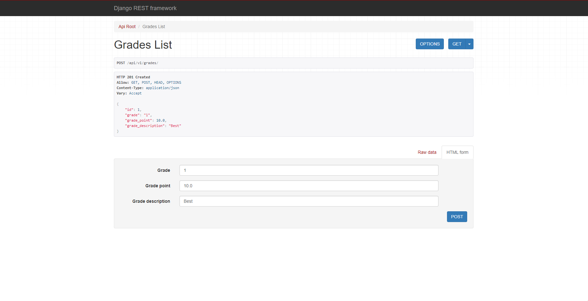
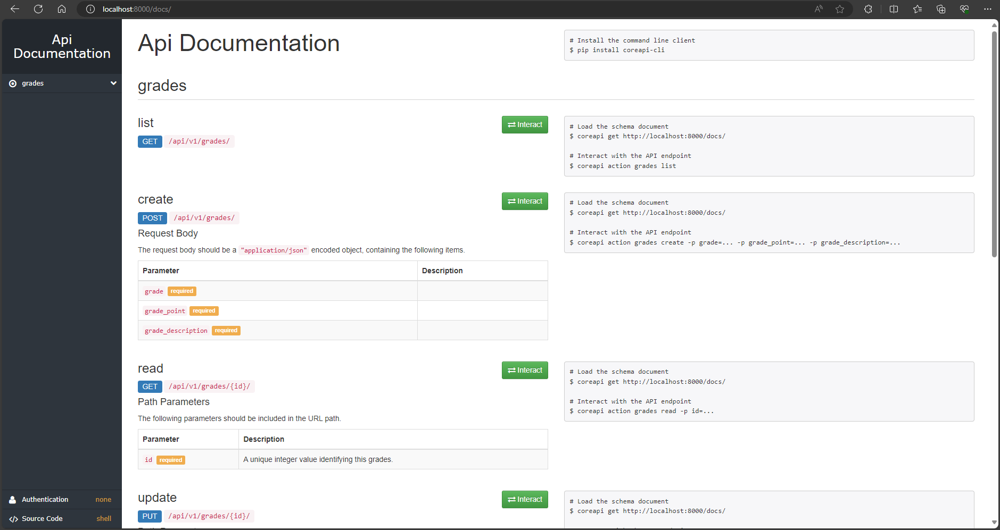

# Django application in dev mode in Docker with djangorestframework 

Project structure:

```cmd
.
├── compose.yaml
├── core
├── api
├── Dockerfile
├── requirements.txt
└── manage.py

```

[_compose.yaml_](docker-compose.yaml)

```cmd
services:
  web:
    build: .
    container_name: django
    volumes:
      - .:/microservice
    ports:
      - "8000:8000"
```

[_Dockerfile_](Dockerfile)

```cmd
FROM --platform=$BUILDPLATFORM python:3.8 AS builder

EXPOSE 8000

WORKDIR /microservice

COPY requirements.txt /microservice

RUN python -m pip install --upgrade pip

RUN python -m pip install --upgrade django

RUN python -m pip install -r requirements.txt

COPY . /microservice

ENTRYPOINT ["python3"]

CMD ["manage.py", "runserver", "0.0.0.0:8000"]
```

## Deploy with docker compose

```cmd
$ docker compose up -d
```

## Expected result

Listing containers must show one container running and the port mapping as below:

````cmd
$ docker ps
CONTAINER ID        IMAGE               COMMAND                  CREATED              STATUS              PORTS                    NAMES
b99abb5e954a        microservice-web    "python3 manage.py r…"   About a minute ago   Up About a minute   0.0.0.0:8000->8000/tcp   django```

After the application starts, navigate to `http://localhost:8000` in your web browser:

Stop and remove the containers

```cmd
$ docker compose down```
````

Too see API navigate to `http://localhost:8000/api/v1/` in your web browser.

Too see Documentation navigate to `http://localhost:8000/docs/` in your web browser.




